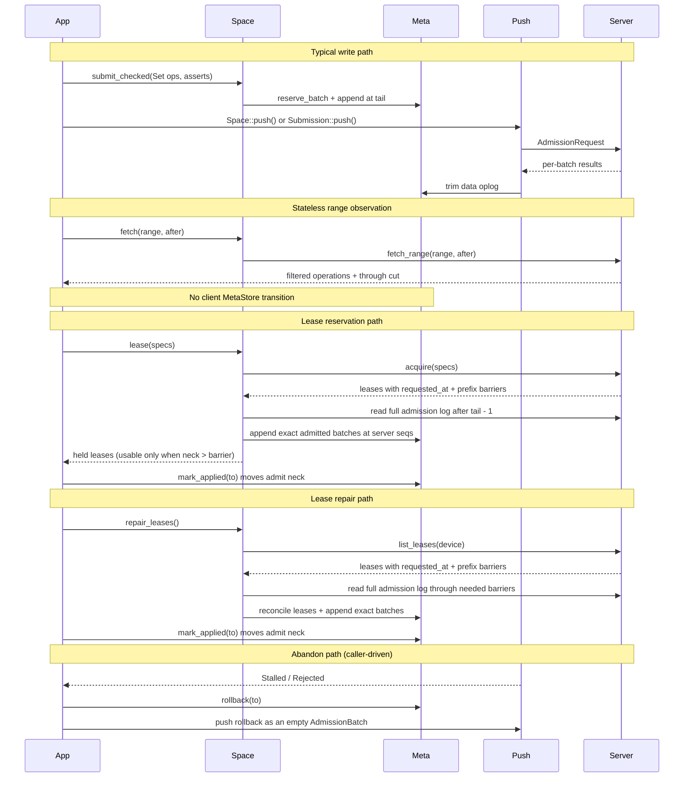

# Admission + rollback v2 (consolidated rebuild)

**Supersedes:** [`admission_rollback_model_81337dca.plan.md`](admission_rollback_model_81337dca.plan.md)

**Workflow:** Stash all current uncommitted WIP. Land each phase below as a focused commit. Review before starting the next phase. New ideas go in **Backlog** until explicitly promoted.

---

## Starting point (after stash)

**Already on `main` (committed, keep):**

| Commit | Content |
|--------|---------|
| `722b3cc` | `attach.rs`, `engine_encrypted.rs`, `equivalence.rs`, `fault_meta.rs` tests; minor cargo/doc touches |
| `24e3ccd` | `client_torture.rs` DST harness |

**Revert / do not carry from WIP:**

- `.vscode/settings.json` theme change
- `server/tests/lease_props.proptest-regressions` (artifact)

**Everything else in the dirty tree is reimplemented phase-by-phase below** — do not cherry-pick the monolithic diff.

---

## Core invariants (unchanged + updated)

### Unchanged

- One `DeviceSeq` / oplog stream per **space** per device; device identity remains client-global, but queue state is space-scoped.
- **head / neck / tail** cursors; `[neck, tail)` is the active certify/push window; dead rows in `[head, neck)` after rollback.
- Anything in `[neck, tail)` not yet server-acked is **not guaranteed**. Callers that need per-write certainty hold the returned `Submission { seq }` and call `submission.push().await`, which is sugar over `space.push_until(seq).await`.
- Device-seq **gaps are legal** after rollback.
- Range asserts: the greatest historical admission under the prefix from a device other than the submitter must be `<= upto`; same-device predecessors are carried by the `DeviceSeq`/history chain.
- Lease **evidence** may include `LeaseId`s for diagnostics / richer errors, but is never admission authority.
- Leases are **reservations**, not required write capabilities: writes without a held lease are admitted when no active incompatible lease conflicts with their keys.
- Client lease state is always a **subset of authority**: local active leases may lag server grants, but must never outlive local release intent.
- Client coordination state is owned by a **single-owner event loop**. The loop serializes all correctness-state transitions and performs no slow work itself: blocking work (SQLite, bulk crypto) runs on worker threads, concurrent work (network, timers) runs in tasks, and both communicate with the loop via channels. The loop is the correctness chokepoint, never the performance chokepoint.
- Data batches evaluate sequentially on server scratch; no lease acquire/release ops appear in the oplog or `AdmissionBatch`.
- Multi-batch `AdmissionRequest`: simulate sequentially, commit **all-or-nothing**.
- **Fork** (duplicate device identity) is fatal; server-ahead catch-up uses **trim**, not rollback.
- **`certify` at `Client::open`** — production safety net (not sim-only). Do **not** feature-gate.

### Updated (post original plan)

| Topic | Original plan | **v2 decision** |
|-------|---------------|-----------------|
| Space lease API | Lease ops folded into data commits | **Split:** data mutations via `Space::submit_checked` / `submit_unchecked`; leases stay sync named verbs, including repair listing |
| Write admission | Every write needs presented write lease | **Optimistic by default:** write admitted unless an active incompatible lease covers/conflicts with the key |
| Lease stealing | Stealable leases + `steal=true` preemption | **Removed:** no pre-deadline lease stealing; takeover is a later explicit/admin flow |
| Client release state | Drop after server release | **Forgotten first:** local release intent removes authority before remote release; retained for retry until ack |
| Lease deadline margin | 0.1% of TTL | **max(0.1% of TTL, 10ms)** floor for local authority expiry |
| `Mutation::Delete` | Separate delete mutation | **Explicit `Delete { key }` inside a sealed `DeviceEntry`** — server-aware; no sentinel value |
| Value binding | Opaque ciphertext + combined metadata | **`DeviceEntry { mutation, tag, seal }`** is the complete client-authenticated object; server wraps it unchanged in `AdmittedEntry` |
| Awaited data writes | Special `Sync` mode | **Sugar, not mechanism:** `Submission::push()` calls `space.push_until(seq).await` and extracts that seq's disposition |
| Client session state | (implicit in-memory cursors) | **Disk-only:** `Client` holds device + session attach map; per-space oplog cursors load from `MetaStore` each push; `PushOptions` per push call |
| Oplog scope | One client-level oplog | **Per-space oplog:** cross-space/client-level oplog deferred for future two-phase commits |
| Meta reservation | `reserve_commit` + `reserve_batch` | **`reserve_batch` only** on trait; ver stamping in `Space::submit_*` |
| Lease epoch | Removed in Phase 7 after 1–6 | **Early Phase 2** when starting fresh — no epoch-dependent code |
| `resume_pending()` | Required in Phase 4 | **Backlog** — not in initial rebuild |

---

## Architecture (v2)



---

## Design: `Seal` + explicit `Delete` (brainstorm #1)

**Decision (2026-07-06):** All client data mutations carry a **`Seal`**. The server stores it opaquely but distinguishes **Set** (key + seal + ciphertext) from **Delete** (key + seal only). Clients verify seals on read using key-bound AAD.

### `Seal` wire shape (41 bytes fixed header)

```rust
#[repr(u8)]
pub enum SealScheme {
    AeadV1 = 0,
}

impl TryFrom<u8> for SealScheme {
    type Error = UnknownSealScheme;
    fn try_from(value: u8) -> Result<Self, Self::Error>;
}

impl From<SealScheme> for u8 {
    fn from(value: SealScheme) -> u8;
}

pub struct Seal {
    pub scheme: SealScheme,  // wire-encoded as u8; AeadV1 = 0
    pub nonce: [u8; 24],     // AEAD nonce
    pub aead: [u8; 16],       // Poly1305 authentication tag (not AdmissionTag)
    pub payload: Vec<u8>,     // opaque scheme extension; empty for AeadV1
}
```

- **`scheme`** identifies the sealing/encryption scheme, not the op kind. Initial enum has one variant, `AeadV1 = 0`, with explicit checked conversion to/from the wire `u8`.
- **Present (`Set`):** `DeviceEntry { mutation: Mutation::Set { key, value: Ciphertext }, tag, seal }`.
- **Delete:** `DeviceEntry { mutation: Mutation::Delete { key }, tag, seal }`; AEAD plaintext is `b""`.
- **Future `DeleteRange`:** same seal machinery over range metadata + prefix (backlog until specified).
- **Scheme payload:** `Seal.payload` is opaque extension data for future schemes. For `SealScheme::AeadV1`, it must be empty and decoders should reject non-empty payloads.
- **Empty Set privacy:** because the AEAD tag lives in `Seal.aead`, encrypting raw `b""` for a Set would produce empty ciphertext and leak "empty logical value" to the server. Do not use key material as a deterministic IV/nonce; the same key would repeat across writes. Key components are non-empty, but that does not make them safe nonces. Instead, the value cipher must encrypt a non-empty Set plaintext frame (for example a versioned length/value frame, with optional padding buckets later) so even an empty logical value has non-empty ciphertext.

### AAD / verification (client-only; server opaque)

When computing or verifying a seal, include in AEAD associated data:

1. **Anonymized key** — `encode_key(key)` bytes (same as today's `value_aad` key component).
2. **Write context** — device, device_seq, ver, and `cipher_epoch` / value-key epoch as today.
3. **Scheme + op kind** — bind `scheme` and the explicit op kind (`Set`, `Delete`, later `DeleteRange`) so a delete seal cannot be replayed as a set seal on the same key/version context.

Clients decrypt/verify on `read_at` / local replay; the kernel never interprets seal bytes.

### Kernel storage model

The canonical entry model is:

```rust
pub enum Mutation<T = Vec<u8>> {
    Set { key: Key, value: T },
    Delete { key: Key },
}
pub struct DeviceTag { device: DeviceId, device_seq: DeviceSeq, ver: Ver, cipher_epoch: CipherEpoch }
pub struct DeviceEntry<T = Ciphertext> { mutation: Mutation<T>, tag: DeviceTag, seal: Seal }
pub struct AdmissionTag { admission_seq: AdmissionSeq }
pub struct AdmittedEntry<T = Ciphertext> { device_entry: DeviceEntry<T>, admission: AdmissionTag }
```

- **`read_at` deltas** emit admitted Delete mutations — replicas observe deletes.
- **`get` / `list`** skip deleted rows (live entries only), same contract as today.
- `DeviceTag` contains every client-minted AAD field. `AdmissionTag` is server-minted and deliberately outside AAD. Neither carries a lease id.

### Why not tombstone-on-Set?

- Honest delete on the wire and in admission (distinct op, no value smuggling).
- Enables server-side delete awareness (`live_count`, future `DeleteRange`) without parsing ciphertext.
- Cryptographic proof of intent: delete seal = AEAD over empty plaintext bound to this key only.

### Open questions (resolve during Phase 1 / 5 implementation)

| Question | Lean |
|----------|------|
| Scheme numbering | `SealScheme::AeadV1 = 0`; later variants only when encryption/sealing changes |
| Scheme payload | `Seal.payload` exists for future extension; `AeadV1` requires it to be empty |
| Plaintext mode | Seal with `SealScheme::AeadV1` passthrough/trivial AEAD placeholder if needed; same shapes on wire |
| Zero-length present | Allowed via `Set`; distinct from `Delete` because op kind is bound in AAD |
| Empty Set ciphertext | Must be non-empty via a Set plaintext frame; never derive nonce/IV from key components |
| Key components | User key components must be non-empty; this is for key hygiene, not nonce derivation |
| `stamp_*` in submit | Rename to `stamp_data_ops` — assign `ver` for both `Set` and `Delete` |
| Per-write push sugar | `Submission::push()` applies to any submitted data op (`Set` **or** `Delete`) by pushing through the returned seq |

---

## Phase 0 — Baseline

1. `git stash push -u -m "admission WIP pre-v2"`
2. Confirm `cargo test --workspace` green on committed `main`
3. Optional: add `lease_props.proptest-regressions` to `.gitignore`

---

## Phase 1 — Core types and wire surface

**Files:** `core/src/messages.rs`, `core/src/lease.rs`, `core/src/tag.rs`, new `core/src/seal.rs` (or in `tag.rs`)

### `Seal`

```rust
pub struct Seal {
    pub scheme: SealScheme,
    pub nonce: [u8; 24],
    pub aead: [u8; 16],
    pub payload: Vec<u8>,
}
```

Fixed 41-byte wire header after `SealScheme <-> u8` encoding, followed by the scheme payload length/bytes in whatever wire encoding the transport uses. `AeadV1` requires an empty payload. `Set` ops carry additional ciphertext bytes; `Delete` ops do not.

### Lease kinds

```rust
pub enum LeaseKind { Forever, Bounded(Duration) }
// LeaseSpec { prefix, mode, kind }

pub struct AcquireLeasesRequest {
    pub device: DeviceId,
    pub requested_at: HybridTimestamp, // client-minted; server treats as opaque
    pub specs: Vec<LeaseSpec>,
}

pub struct AcquireLeasesResponse {
    pub leases: Vec<Lease>,
}

pub struct Lease {
    pub id: LeaseId,
    pub prefix: Key,
    pub mode: LeaseMode,
    pub kind: LeaseKind,
    pub requested_at: HybridTimestamp, // client clock from grant/refresh request
    pub granted_at: Timestamp,     // server clock; diagnostic/repair input
    pub ttl: Duration,
    pub barrier: AdmissionSeq,     // effective_prefix_max(prefix) when this lease was granted/refreshed
}
```

- `barrier` is **prefix-scoped in meaning** but shares the global `AdmissionSeq` domain: its value is `effective_prefix_max(lease.prefix)` at grant/refresh time, not the server's global admission high-water. The client nevertheless replicates the complete dense server log through that sequence before the lease can become application authority; unrelated writes do not raise the barrier but may be replayed on the way to it.
- `requested_at` is minted by the client before sending the acquire/refresh request and stored on the lease. The server does not compare it with server time and must not use it for authority; it returns it so the owning client can anchor local deadline math in the client time domain.
- Server lease expiry remains server-domain: `granted_at + ttl`. Client local usability is conservative: for bounded leases, local authority expires at `requested_at + ttl - margin`. Because the server grants at or after the client request timestamp, this may expire local authority earlier than server authority, preserving the subset invariant.

### Lease repair

```rust
pub struct ListLeasesRequest {
    pub device: DeviceId,
}

pub struct ListLeasesResponse {
    pub leases: Vec<Lease>,
}
```

- `ListLeasesResponse.leases` contains all active leases in the space held by `device`.
- Leases carry original client `requested_at`, server `granted_at`, and original `ttl`, not remaining TTL. Server timestamps are never compared directly to client timestamps.
- `ListLeasesResponse` does **not** include `server_now`. For bounded leases, the client reconstructs its conservative local deadline from the returned lease as `requested_at + ttl - margin`.
- Each lease's `barrier` is the prefix-scoped `effective_prefix_max(prefix)` when that lease was granted/refreshed. Repaired leases are not local authority until the complete admit-log prefix is captured and applied so `neck > barrier`.
- Client reconciliation records listed leases as Active/pending-barrier, drops local Active leases absent from the server response, and clears Forgotten release intents absent from the server response. Forgotten leases still present on the server remain Forgotten for retry.

### Admission shape

```rust
pub struct RangeAssert { pub prefix: Key, pub upto: AdmissionSeq }

pub struct AdmissionBatch {
    pub device_seq: DeviceSeq,
    pub range_asserts: Vec<RangeAssert>,
    pub entries: Vec<DeviceEntry>,
}

pub struct AdmissionRequest {
    pub device: DeviceId,
    pub evidence: Vec<LeaseId>,  // diagnostic only; never admission authority
    pub batches: Vec<AdmissionBatch>,
}

pub struct AdmissionResponse {
    pub results: Vec<AdmissionResult>, // exactly one result per input batch
}

pub enum AdmissionResult {
    Applied { admission_seq: AdmissionSeq },
    Failed { error: BatchError },
}
```

- Remove authoritative `AdmissionRequest.leases` and `LeaseRef`; keep `Vec<LeaseId>` evidence on data batches for diagnostics / richer errors only.
- Keep lease verbs (`acquire` / `release` / `list_leases`) outside `AdmissionBatch`.
- Acquire refreshes same-device compatible held leases in place where possible; no data push is required before lease calls.
- Remove lease stealing entirely: no `stealable` field, no `steal` argument, and no pre-deadline preemption.
- `Mutation::Delete` is the only tombstone representation; no `PutEntry`, `Value`, `BatchOp`, or explicit NoOp type remains.
- A rollback is represented on the wire by an `AdmissionBatch` with empty `entries`; sequence and range-assert fields retain their normal meaning.

### Causal range-assert semantics

- `upto` is inclusive. For a batch from device `D`, `RangeAssert { prefix, upto: S }` means: the greatest historical admission under `prefix` from any device other than `D` is at most `S`.
- Earlier submissions from `D` do not invalidate the assertion. Their order and identity come from the per-space `DeviceSeq` stream and, once B14 lands, its cumulative history commitment. This lets an offline device queue arbitrarily many dependent submissions against one server cut and later push them in one request or across several requests.
- Each prefix aggregate stores the two greatest historical `(device, admission_seq)` points from distinct devices. To compute the maximum excluding `D`, use the first point unless it belongs to `D`, then use the second. These points are monotonic history, updated by Set and Delete, and are not removed by overwrite or tombstone.
- This is concurrency control under the honest-server model, not same-device fork proof. Until B14, a duplicated device identity remains subject to the existing replay-fence limitations; B14's canonical history chain closes that hole.

### Oplog (client-local)

```rust
pub struct OplogCursors { pub head, pub neck, pub tail: DeviceSeq }

pub enum DeviceOp {
    Commit {
        entries: Vec<DeviceEntry>,
        range_asserts: Vec<RangeAssert>,
        evidence: Vec<LeaseId>,
    },
    Rollback {
        marker: RollbackMarker,
    },
}
```

- Oplog storage is keyed by `(space_id, device_seq)` and each space has its own `OplogCursors`.
- Checked vs unchecked is a client-side pre-append policy selected by the `submit_checked` / `submit_unchecked` API; it does not need to be stored in `DeviceOp` after local qualification succeeds.
- `Submission::push()` is API sugar, not oplog state. The durable fact is still only the appended record at `device_seq`.
- MetaStore methods that read/write oplog state take `space_id` explicitly: reservation, append, scan, trim, rollback, cursor load/certify.
- `DeviceSeq` remains part of server tags and replay fences, but monotonicity is per `(space, device)`, matching server admission.
- A future client-level oplog may be added only for cross-space/two-phase commit orchestration.

**Exit:** core compiles; server/client stubs updated for new message shapes.

---

## Phase 2 — Remove lease `Epoch` (moved up)

Do this early on a fresh branch so nothing new depends on epoch.

| Remove | Replace |
|--------|---------|
| `Tag.epoch`, `Lease.epoch`, `LeaseRef` | No lease id/epoch in data tags; `LeaseId` remains lease-table identity only |
| `CountersRecord.next_epoch` | deleted |
| `KernelError::Fenced` | `LeaseInvalid` / `LeaseConflict` |
| Evidence as `{id, epoch}` | `Vec<LeaseId>` diagnostic-only; never admission-checked |

- Bump `DataRecord` / `LeaseRecord` encode (fresh test stores OK).
- **Not in scope:** `cipher_epoch` / `SpaceEnvelope` rotation — unrelated crypto-key concern.

**Exit:** grep clean for lease `Epoch`/`Fenced`/`LeaseRef` in core+server+client (except cipher/value-key epoch naming); evidence remains `Vec<LeaseId>` only.

---

## Phase 3 — Server admission rewrite

**Files:** `server/src/space/data.rs`, `server/src/space/lease.rs`

Rewritten semantics:

1. Device seq fence: `device_seq > last_seq` (gaps OK).
2. Per data batch: range asserts compare the scratch foreign-device prefix maximum to inclusive `upto`, then apply sequential `Set` / `Delete` ops. Earlier scratch writes from the same device do not invalidate later assertions in the request.
3. **Set and Delete** require per-key `ver` monotonicity and must not conflict with any active incompatible lease held by another device/range; no presented lease is required.
4. Multi-batch: all-or-nothing durable apply.
5. Return `AdmissionResponse.results` with exactly one `AdmissionResult` per input batch.
6. `evidence: Vec<LeaseId>` may be consulted only to improve rejection details; it never authorizes a write.
7. Prefix aggregates: update on **data writes only** (`Set` and `Delete`); real deletes keep `live_count` accurate because the server can distinguish present vs deleted values.

### Multi-batch result policy

- V2 admission is still all-or-nothing: if any batch fails, no batch is durably applied.
- Response shape is future-proofed as per-batch results:
  - success path: every element is `Applied { admission_seq }`;
  - failure path: failed/evaluated batches get `Failed { error }`; later batches may also get `Failed { error: NotEvaluated }`.
- For range-assert / lease-assert style failures, evaluate all asserts in the failed batch and include all failed assertions in that batch's error details.
- This response shape preserves room to relax all-or-nothing later without changing the client/server wire type.

Lease verbs remain separate sync operations:

- `acquire(requested_at, specs)` grants/refreshes reservations and returns leases carrying the stored client `requested_at` plus per-lease prefix barriers.
- `release(ids)` drops reservations idempotently.
- `list_leases(device)` returns active leases held by that device; each lease carries its original client `requested_at`, original `ttl`, server `granted_at`, and prefix-scoped grant barrier.
- Incompatible active leases deny new acquires until released or expired; no steal path.
- A held write lease by the same device should allow writes under it; an incompatible active lease by another device rejects the write.

**Exit:** server unit/prop tests for sequential ops, asserts, per-batch result vector length, all failed asserts reported within a failed batch, multi-batch all-or-nothing, lease-conflict write rejection, and writes admitted without leases when no conflict exists.

---

## Phase 4 — Client meta: rollback + certify

**Files:** `client/src/meta.rs`

### Per-space oplogs

- `ClientState` keeps device identity globally, but queue/cursor state under each `SpaceState`.
- `OplogCursors { head, neck, tail }` and `DeviceOp::{Commit, Rollback}` records are keyed by `SpaceId` and persisted in `MetaStore`.
- `MetaStore::reserve_batch`, `commit`, `oplog`, `trim_oplog`, `rollback`, and cursor/certify helpers take `space_id` and operate only on that space's queue.
- `next_seq` is replaced by the space's `tail`; the "collapse `next_seq` vs tail" backlog item is part of this phase.
- There is no separate in-memory scan pointer or second cursor set; every push iteration reloads or transactionally updates disk `head/neck/tail`.
- Ver high-water is space-local and persisted with that space's state; stamping a write in one space must not consume or depend on another space's version high-water.

### `rollback(to: DeviceSeq)`

- Validate against that space's cursors: `neck <= to < tail`.
- Append `DeviceOp::Rollback { marker }` at that space's `tail`; `neck = tail`; `tail += 1`; `head` unchanged.
- Remove `discard_from`.

### `reserve_batch` only

- Single reservation path on `MetaStore` trait.
- Caller assigns `ver` on Set/Delete ops before reserve (see Phase 5).
- Conformance tests use a free `set_ops_from_entries(high, entries)` helper — not on trait.

### `certify(state)`

- For each space, walk `[neck, tail)` only; the space-local `ver_high` checks active ranges.
- Lease records marked **Forgotten** never count as local authority, but remain durable release intents.
- Called unconditionally at `Client::open`.

### Lease release intents

- Local lease records have an authority state: **Active** or **Forgotten**.
- Both client release methods first persist `Forgotten` locally, then call the remote `release` verb.
- If remote release succeeds, delete the local lease record.
- If remote release fails or is unavailable, keep the Forgotten record so a later retry can release the server-side reservation.
- `leases()` / local checked-write logic / evidence collection must treat Forgotten leases as non-existent authority.

### Lease deadline margin

- Local authority expires at `deadline - margin`, where `margin = max(ttl / 1000, 10ms)`.
- Apply the same margin for active lease usability, checked-write local conflict/authority reads, and `leases()` reporting.

**Exit:** meta unit tests for per-space cursors, cross-space queue isolation, rollback validation, certify gaps, reserve_batch, deadline-margin floor, and Forgotten leases never counting as local authority while remaining retryable.

---

## Phase 5 — Data-only `Space::submit_*` + lease API

**Files:** `client/src/space.rs`, `client/src/cipher.rs`

### Public API

```rust
// Data mutation surface on Space.
space.submit_checked(mutations: Vec<Mutation>, range_asserts: Vec<RangeAssert>) -> Submission
space.submit_unchecked(mutations: Vec<Mutation>, range_asserts: Vec<RangeAssert>) -> Submission

pub struct Submission {
    pub seq: DeviceSeq,
    // private: owning Space handle/ref used by push()
}

impl Submission {
    // Convenience only: calls space.push_until(self.seq).await and returns this seq's disposition.
    pub async fn push(self) -> PushReceipt;
}

// Stream controls.
space.push() -> PushOutcome
space.push_until(seq: DeviceSeq) -> PushOutcome

// Ops-only inbound log surface.
space.pull() -> AdmissionSeq
space.fetch(range: Range, after: AdmissionSeq) -> RangeFetch
space.admits().iter_from_neck() -> Iterator<AdmittedBatch>
space.admits().mark_applied(to: AdmissionSeq) -> ()
space.admits().trim(to: AdmissionSeq) -> ()

// Lease reservation surface.
space.lease(specs: Vec<LeaseSpec>) -> Vec<Lease>
space.unlease_checked(leases: Vec<LeaseId>) -> ()
space.unlease_unchecked(leases: Vec<LeaseId>) -> ()
space.repair_leases() -> Vec<Lease>
```

Each space has independent submit-log and admit-log `head/neck/tail` cursors.
Admit cursors are exclusive server `AdmissionSeq` positions. Pull appends
complete dense server batches at those same sequence numbers and moves admit
`tail`.
The application advances admit `neck` with `mark_applied`; `trim(to)` may move
admit `head` only through `neck`. Homebase never applies operations or stores a
materialized KV replica. `fetch(range, after)` is an observational server read
and mutates none of this client state.

**Removed:** public `acquire()` and `Acquired`. `lease()` is the only reservation API. It may acquire or reuse server reservations and pulls the complete server log until `tail > barrier`. Returned leases are held reservations but become locally usable only when admit `neck > barrier`. `unlease_checked()` and `unlease_unchecked()` remain explicit and sync. The wire verbs stay `acquire` and `release`.

### Inside `submit`

1. Reserve a `DeviceSeq` and consecutive `ver` values from the space-local disk `ver_high` for each mutation.
2. **`submit_checked`:** locally fast-fail only when the client cannot substantiate the caller's range assertions: for every asserted prefix, require a live local read or write lease whose prefix covers it, require admit `neck > lease.barrier`, and require `neck > upto`. Because neck is the complete applied server-log prefix, no range-local coverage map is needed. Server admission remains authoritative.
3. **`submit_unchecked`:** skip the local lease/range-assert gate; server admission still decides.
4. **`reserve_commit`** → build sealed `DeviceEntry` values with `encode_device_entry` → atomically append the finished `DeviceOp::Commit` to `MetaStore`.
5. Return `Submission { seq }` after durable local append.
6. `Submission::push()` is convenience only: it calls `space.push_until(seq).await` and extracts the disposition for this exact seq. It does not add a second admission/await mechanism.
7. There is no empty-oplog precondition for `Submission::push()`. Semantics match "submit locally, then push through my seq"; earlier queued ops in the same space may be pushed first as part of reaching the target seq.

### Inside `lease` / `unlease`

- `lease()` mints client `requested_at`, calls the server `acquire` verb directly when needed, records returned leases with local deadlines derived from `lease.requested_at + lease.ttl`, and pulls the complete server log until admit `tail > lease.barrier`. It returns held leases without applying their records.
- Lease usability is derived, never stored as a pending bit: `held && live && admit_neck > lease.barrier`.
- Admit-log append atomically advances `tail` and `ver_high`; `mark_applied` atomically advances `neck`. Checked assertions require `neck > upto`. Stateless range fetch changes none of these facts.
- `lease()` is allowed with non-empty local oplogs; it does not push buffered data first.
- Every `DeviceOp::Commit` persists a local-only `SubmitMode::{Checked, Unchecked}` field. It is not sent to the server or included in AAD.
- `unlease_checked()` scans active checked commits and refuses to remove the last live covering reservation for any queued range assertion. Coverage is re-evaluated after excluding the complete unlease set; unchecked commits do not block it. A replacement reservation may preserve server exclusion for an already-validated submission even while `neck <= its barrier`, but it cannot validate a new local check until neck passes that barrier.
- `unlease_unchecked()` skips that guard. Both unlease methods first mark leases Forgotten locally, then call the server `release` verb, and delete them locally only after success. Unlease is not appended to the oplog.
- An unapplied lease may be unleased. Later admit-neck advancement must not recreate or return a released, forgotten, or expired lease.
- A failed/unavailable release leaves Forgotten records behind for retry; callers and local checks treat them as already gone.
- `repair_leases()` first calls `list_leases(device)` without changing local state. After a successful response, it atomically reconciles Active/Forgotten records, clears records no longer live server-side, stamps repaired deadlines from each returned lease's `requested_at + ttl`, and pulls the complete missing server-log suffix. It never applies or discards admit records. An unavailable repair leaves existing conservative local authority unchanged.
- Renewal requests carry a fresh client `requested_at`; the server stores it with the refreshed `granted_at` and TTL so a later repair can reconstruct the deadline entirely in the client's clock domain.

### Cipher

- `encode_device_entry(mutation, DeviceTag, nonce)` for Set and Delete.
- **`encode_seal` / `verify_seal`** — AEAD with key-bound AAD (scheme + op kind + anonymized key/range descriptor + write context + `cipher_epoch`).
- **Delete:** encrypt empty plaintext → `Seal` only; **Set:** encrypt payload → `Seal` + ciphertext.
- **`open_admitted_entry`** on read: verify the seal and return `AdmittedEntry<Vec<u8>>` with the same mutation shape.

**Exit:** space driver tests for data submit API, admit-log lease gating, unlease, unlease retry after unavailable server, lease repair after local state loss/staleness, and acquire/release/list_leases working while local submit logs are non-empty.

---

## Phase 6 — Push + ack

**Files:** `client/src/client.rs`, `client/src/space.rs`

### Client shape

- Client coordination runs as a single-owner event loop. Public `Space`/`Submission` handles send commands into the loop; all oplog cursor movement, lease-state changes, rollback decisions, and ack application happen there.
- The loop does not perform slow work inline. SQLite/meta transactions and bulk crypto run on blocking worker threads; network calls and timers run as async tasks. Workers/tasks report results back over channels, and the loop applies them in serialized order.
- Treat the loop as the correctness chokepoint, not the performance chokepoint: if a step can block or burn CPU, offload it and re-enter the loop only with the result.
- No `ClientGlobals` (`next_seq`, `scan_from`, `push_cap` in memory).
- `PushOptions { wait_through, cap }` per space push call.
- Per-space cursors read from `MetaStore::load(space)` / equivalent each push iteration.

### Push

- Public push is space-scoped (`space.push()` and `space.push_until(seq)`); there is no public global `client.push()` that silently iterates spaces.
- Push scans that space's disk `[neck, tail)`; coalesce up to `cap`; honor optional `wait_through`.
- Rollback record → wire batch with empty `entries`, preserving sequence/fork semantics without a NoOp mutation.

### Ack (`through`)

1. `trim_oplog(through)`.
2. Advance disk cursors only; no lease hydration/drop happens during data ack.

### Fork vs trim

- Each `(space, device)` has a cumulative 32-byte `DeviceChecksum`, beginning at all zeroes for seq 0; every extension uses a versioned domain separator.
- For each admitted batch, the server recomputes `next_hash = H(domain, previous_hash, space_id, device_id, device_seq, canonical_batch)`; canonical batch content includes ordered range asserts and data ops (keys, vers, seals, ciphertext), and excludes diagnostic lease evidence.
- A push presents the client's persisted confirmed `DeviceChecksum`. The server admits only when it equals the server's current checksum for that device stream, chains across every batch in the request, and atomically stores only the final checksum with the data apply.
- The client atomically persists the returned final checksum with trimming the acknowledged oplog prefix. No per-batch checksum history is required on the server.
- When the server is ahead after a lost response, the client hashes forward from its confirmed checksum across the retained local batches through the server's current seq. A matching final checksum validates every intermediate batch and permits catch-up trim; a mismatch or missing local path is a fatal fork.
- Rollback's dead `[head, neck)` records do not enter the history chain. The admitted empty rollback batch extends the chain like any other wire batch.
- The expected-head check prevents a rollback marker from skipping over a data batch that the server admitted before a client crash or lost response; before B14, callers must reconcile every ambiguous push outcome before invoking rollback.
- This intentionally adds one correctness-bearing persisted checksum per `(space, device)` on the server and one confirmed checksum per client space; it is not derivable from `head/neck/tail` because rollback can put `neck` ahead of the server and a lost response can put the server ahead of `neck`.
- Do not add a random `SubmissionId`: sequence number plus cumulative content commitment supplies ordering, exact batch identity, and complete-prefix validation. This remains honest-server fork/rollback detection, not protection against Byzantine server equivocation without an external witness.

### Submission push sugar / wait-through

- There is no separate `settle_seq` cursor or state machine.
- `space.push()` is the low-level "move this space's stream as far as possible" control.
- `space.push_until(seq)` is the low-level "move this space's stream until at least this seq has a disposition" control.
- `submission.push()` is sugar over `space.push_until(self.seq).await`; it extracts and returns the target seq's disposition from the push outcome so the common "push my write" case is correctly attributed.
- `space.push()` pushes the stream; `submission.push()` pushes until this submission has a disposition.
- `submit_*` remains the only local append operation.
- Success means that seq has been acked/trimmed from the target space's disk oplog.
- On stall/failure at or before the target: return the target seq's failure/stall disposition — **no** automatic rollback.

**Exit:** push/wait-through/ack tests; `Submission::push()` attribution tests; fork vs trim tests from engine.

---

## Phase 7 — Submit/push ergonomics (policy summary)

| API | Meaning | On stall/failure |
|-----|---------|------------------|
| `space.submit_checked(ops, asserts)` | Local append after local lease/range-assert gate; requires a live covering lease plus admit `neck > lease.barrier` and `neck > upto`; returns `Submission { seq }` | Caller owns retry/push/rollback policy |
| `space.submit_unchecked(ops, asserts)` | Local append without local gate; server admission still decides | Caller owns retry/push/rollback policy |
| `space.push()` | Push this space's oplog as far as possible | Returns stream outcome |
| `space.push_until(seq)` | Push this space until `seq` is acked/failed/stalled | Returns outcome containing disposition for relevant seqs |
| `submission.push()` | Convenience for `space.push_until(submission.seq).await`, extracting this seq's disposition | Returns this seq's disposition; no automatic rollback |

### App flow (document in Phase 10)

```rust
let submission = space.submit_checked(set_ops, asserts).await?;
let receipt = submission.push().await?;

let leases = space.lease(vec![write_spec(db)]).await?; // may append admit records
for batch in space.admits().iter_from_neck().await? {
    consumer.apply_atomically(&batch)?;
    space.admits().mark_applied(batch.admission_seq.next()).await?;
}
space.push().await?;
```

**Exit:** rollback.rs tests for checked/unchecked submit, `push_until` wait-through, `Submission::push()` disposition attribution, stall leaves oplog, disk cursors survive reopen.

---

## Phase 8 — Tests

| Area | Action |
|------|--------|
| `client/tests/rollback.rs` | New — `submit_checked` / `submit_unchecked`, `push_until`, `Submission::push`, stall, rollback marker, cursors |
| `client/tests/common/mod.rs` | Test helpers only (`set_op`, `blocking_lease`, `blocking_unlease`, …) — **not** exported from crate |
| `engine.rs` / torture / equivalence / sim | Update for AdmissionBatch shape, data-only submit/push, Fork trim |
| meta conformance | per-space head/neck/tail; space-local `ver_high`; certify `[neck,tail)` per space |
| lease release | Forgotten lease is not authority, survives failed release, retries until remote ack deletes it |
| lease deadlines | local usability margin is `max(ttl / 1000, 10ms)` |
| lease repair | `list_leases` restores server leases, full-log pull captures through their barriers, returned `requested_at + ttl` reconstructs local deadlines, stale Active and acked Forgotten records clear, and restored leases remain unusable until admit `neck > barrier` |
| client event loop | coordination-state transitions are serialized through the loop; blocking SQLite/bulk crypto are offloaded; network/timers return via channels |
| server props | sequential ops, assert aggregation, per-batch results, multi-batch all-or-nothing, write-without-lease, lease-conflict rejection |

Build on committed test harness (Phase 0).

**Exit:** `cargo test --workspace` green.

---

## Phase 9 — Prefix aggregates + range delete prep (optional, staged)

Seal + explicit `Delete` land in Phases 1/3/5. Phase 9 is follow-on kernel cleanup and `DeleteRange` prep.

### Stage A — Keep `live_count` correct

- Do **not** drop `live_count`. Real `Mutation::Delete` entries give the kernel enough information to maintain it correctly.
- Update prefix aggregate tests for present → delete, delete → present, repeated delete, and zero-length present values.
- Snapshot may keep the `live_count == 0` fast-path because deleted rows are server-visible and counted out of liveness.

### Stage B — `DeleteRange` (when specified)

- New `Mutation::DeleteRange { prefix, ... }` shape carried by a sealed `DeviceEntry` — the seal uses the same `{ scheme, nonce, aead, payload }` shape with AEAD plaintext `b""` or specified range metadata, and AAD bound to op kind plus anonymized prefix/range descriptor.
- Admission: range delete is rejected only when an active incompatible lease conflicts with the target prefix/range; single ver bump or per-key vers TBD at design time.
- Prefix aggregate maintenance must remain exact under `DeleteRange`; define and test the `live_count` update strategy before landing the op.

**Exit:** server props updated; cipher delete + delete-range roundtrip tests.

---

## Phase 10 — Documentation

- `DESIGN.md`: data batches, per-space oplogs, single-owner client event loop, sync lease reservations, lease-conflict admission, range asserts, oplog submit/push policy, data submit API, caller-driven rollback.
- `LAUNCH_CHECKLIST.md`: drop epoch/fenced items; update attach/genesis wording.
- Module docs: per-space head/neck/tail; not-guaranteed-until-pushed; `Submission::push()` is sugar over `space.push_until(seq)`.

---

## Backlog (promote to phases when ready)

Items from conversation + `TODO.md` — **not** scheduled in v2 rebuild unless you explicitly add them:

### Client / meta

- **`resume_pending()`** after open when online (`push_until` wait-through / rollback marker push / offline push retry semantics).
- Client-level oplog for cross-space / two-phase commits if needed later.
- **`verify` Cargo feature** — gate `meta::conformance`, `server::conformance`, `audit()`; keep `certify` always on.
- Export `blocking_lease` / `blocking_unlease` from crate vs test-only helpers.

### Server / kernel

- Human/admin lease takeover flow — later explicit feature, not pre-deadline stealing.
- **Space certification / auth mode** at space creation.
- **`DeleteRange`** — after single-key Delete + Seal stable (Phase 9B or new phase).

### Leasing / correctness model (TODO OCC notes)

- OCC as base case.
- Forever reservations ≈ local SQLite semantics.
- Forever with human-initiated takeover — explicit recovery path only.
- Bounded — OCC with reduced contention.

### Multilite / infra (existing TODO.md)

- Client disk store (`DiskStore` / redb).
- Serverless attach without leases.
- Crate rename / repo move.
- Identity spec reconciliation (`SpaceEnvelope`, etc.).

---

## Reviewable work batches

Each batch should be reviewable as one commit. Every batch includes the listed tests and a small documentation/module-comment update so the behavior being landed is also described where future readers will look.

| Batch | Scope | Tests | Docs |
|-------|-------|-------|------|
| B0 Baseline | Stash current WIP, confirm committed main, copy this plan into the repo | `cargo test --workspace` | Note baseline commit hashes and WIP exclusions in this plan |
| B1 Seal primitives | Add `SealScheme::{AeadV1}`, checked `u8` conversions, `Seal { scheme, nonce, aead, payload }`, `RangeAssert`, initial Set/Delete scaffolding, and non-empty key components | core roundtrips/shape tests; unknown scheme rejects; `AeadV1` rejects non-empty payload; empty key components reject | core message/seal/key module docs for scheme vs op kind, payload, and non-empty Set plaintext framing |
| B2 Lease wire model | Remove lease epochs/fencing/stealing types; add `Lease { requested_at, granted_at, ttl, barrier }`; add acquire/list/release request-response shapes | core encode/decode; no `Epoch`/`Fenced`/`LeaseRef` grep except unrelated crypto epoch | lease module docs for client/server clock domains and prefix-scoped barrier |
| B3 AdmissionBatch response + oplog shapes | Add per-batch `AdmissionResult`; change local oplog to `DeviceOp::{Commit {..}, Rollback {..}}`; keep evidence diagnostic-only | core serialization tests for result vectors and oplog enum variants | messages/oplog docs for all-or-nothing response semantics and evidence |
| B4 Server lease verbs | Implement no-steal acquire/refresh, idempotent release, `list_leases(device)`, prefix-scoped barriers, `requested_at` storage | server lease unit/prop tests for refresh, expiry, list repair, no stealing, prefix barrier not global high-water | server lease docs for reservation semantics and deadline math |
| B5 Server data admission | Admit explicit Set/Delete mutations without requiring a lease when no incompatible active lease conflicts; use evidence only for errors | server tests for write-without-lease, conflict rejection, same-device held lease, delete admission | server data docs for explicit deletes and leases as reservations, not capabilities |
| B6 Server batch apply + aggregates | Multi-batch scratch apply, per-batch success/failure vector, aggregate all failed asserts in failed batch, maintain `live_count` for real deletes | server props for sequential ops, all-or-nothing, result length, assert aggregation, live_count Set/Delete transitions | server aggregate docs for Present/Deleted and live_count contract |
| B7 Meta per-space state | Move oplogs/cursors and `ver_high` to per-space persisted state; all MetaStore methods take `space_id`; no in-memory cursor mirror | meta conformance for cross-space isolation, space-local versions, cursor persistence, gaps | meta docs for head/neck/tail and space-local versioning |
| B8 Meta rollback/certify | Implement rollback marker append using `DeviceOp::Rollback`; certify `[neck, tail)` per space; keep `certify` always on | rollback validation tests, certify gap tests, reopen/certify tests | meta docs for rollback marker and fork-safety purpose |
| B9 Client event loop scaffold | Route public client/space operations through single-owner coordination loop; offload SQLite/bulk crypto to blocking workers and network/timers to tasks | concurrency tests that state transitions only happen on loop; worker result ordering tests | client module docs for correctness chokepoint vs performance workers |
| B10 Submit API + checked-gate scaffold | Add `submit_checked`, `submit_unchecked`, `Submission { seq }`; persist range asserts with the stamped batch; stamp from space-local `ver_high`; establish the initial exact-watermark gate that B10a replaces with final causal semantics | client submit tests for checked success, missing lease rejection, exact-watermark rejection, unchecked bypass, space-local vers | space docs for submit vs push and checked range-assert scaffold |
| B10a Causal range assertions | Rename `RangeAssert.at` to inclusive `upto`; maintain the two greatest historical admission points from distinct devices per prefix; server checks maximum excluding the submitting device `<= upto`; local checked gate requires an Active covering read/write lease with satisfied barrier and effective coverage watermark `>= upto`; preserve same-device dependent submissions across coalesced and split pushes | core/schema roundtrips; same-device offline dependency chain in one and multiple requests; foreign write after `upto` rejects; foreign write remains visible after own overwrite/delete; parent lease+watermark covers child; sibling and child coverage reject; local watermark above `upto` accepts; document same-device fork test as completed by B14 | core/server/client docs for inclusive `upto`, top-two distinct-device history, local coverage direction, offline chains, and B14 dependency |
| B11 Cipher integration | Implement sealing with scheme/op kind/anonymized key/write context/`cipher_epoch`; delete seal over empty plaintext; Set uses a non-empty plaintext frame before AEAD | cipher tests for Set/Delete roundtrip, empty Set has non-empty ciphertext, key mismatch failure, op-kind replay failure, unknown scheme failure | cipher docs for AEAD AAD fields, Set plaintext framing, and `SealScheme` conversions |
| B11a Canonical entry model | Replace intermediate `BatchOp`/`PutEntry`/`Value`/combined `Tag` shapes with `Mutation`, `DeviceTag`, `DeviceEntry`, `AdmissionTag`, and `AdmittedEntry`; rename `PutBatch` family to `AdmissionBatch`/`AdmissionRequest`/`AdmissionResponse`; rename local oplog record to `DeviceOp`; represent rollback on wire as empty `entries` | full core/server/client/sim target checks; cipher tamper tests; engine, crash, equivalence, and torture suites migrated to the canonical object boundaries | core tag/messages docs plus this plan and DESIGN terminology |
| B12 Lease client API | Expose the initial `ensure`, checked/unchecked release, and `repair_leases` implementation; remove public acquire; persist local `SubmitMode`; implement Forgotten release intents, `max(TTL/1000, 10ms)` deadline margin, barrier pulls, and client-stamped renewals; initially re-evaluate checked assertion coverage by scanning the active oplog and track an indexed optimization in `TODO.md`. The durable admit-log correction is ratified in B15 and implemented by AL1-AL7. | client lease tests for barrier pull, non-empty oplog acquisition, checked release blocks only checked assertions losing their last reservation, unchecked release, forgotten release retry, repair drops stale Active and clears acked Forgotten, unavailable repair preserves local state, renewal repair deadline reconstruction | lease/client docs for subset invariant, guarded release, repair algorithm, and the later admit-log correction |
| B13 Push/ack API | Implement `space.push`, `space.push_until`, `Submission::push`; ack trims data oplog only; rollback emits an empty-entry wire batch | push tests for wait-through, target disposition attribution, stall leaves oplog, ack trim | client docs for two verbs: submit local, push remote |
| B14 Fork/trim + cumulative checksum | Add per-space persisted confirmed `DeviceChecksum`; server recomputes a cumulative canonical batch hash and requires the expected prior checksum; atomically advance the client checksum with trim; validate all retained intermediate batches during server-ahead catch-up; distinguish fatal fork from lost ack; update engine/torture/equivalence/sim harnesses | exact replay and K-batch lost-ack catch-up; altered/omitted/reordered intermediate batch rejection; divergent same-seq and gap fork rejection; empty rollback-batch chaining; server-state rollback detection; crash atomicity; simulation/equivalence updates; `cargo test --workspace` | DESIGN notes for cumulative checksum, duplicate device identity, catch-up trim, and honest-server threat boundary |
| B15 Admit-log + DeleteRange design | Keep `live_count`; ratify exact append-only server admissions, per-space client admit `head/neck/tail` in server `AdmissionSeq`, full-log `pull`, stateless arbitrary-range `fetch`, `mark_applied`, trim-through-neck, neck-gated leases, `AdmissionOrder`, full root metadata, range tombstones, and the reference-model method | design review plus point-delete aggregate regressions; `git diff --check` | link `DELETE_RANGE_DESIGN.md`; state that Homebase is an ops/log service with no managed KV application layer |
| AL1-AL7 Admit-log implementation | Execute the seven independently tested admit-log batches defined in `DELETE_RANGE_DESIGN.md`, then remove the old snapshot/delta/changelog path | tests and docs listed per AL batch | update owning core/server/client module in every batch |
| DR1-DR9 DeleteRange implementation | Execute the nine independently tested range-delete batches defined in `DELETE_RANGE_DESIGN.md`; keep public admission rejected through DR7 and enable it only with client integration in DR8 | tests and docs listed per DR batch | update owning module and standalone design in every batch |
| Final docs sweep | Align `DESIGN.md`, `LAUNCH_CHECKLIST.md`, and module docs with landed behavior | documentation build/checks plus full workspace tests | remove stale Sync/epoch/await_commit/snapshot-delta wording and link this plan |

Suggested commit messages: `batch NN: <short description>`. Promote optional or backlog work only by adding a new batch with its own tests/docs row.

---

## Key risks (updated)

1. **Two-log API** — outgoing writes use the submit log; incoming exact admissions use the admit log. Homebase captures and exposes operations but never applies them to a KV replica.
2. **Local lease subset invariant** — usability is derived as held + live + `admit_neck > lease.barrier`. Unlease must mark Forgotten before network IO; Forgotten leases are retry state, not authority.
3. **Per-space oplog migration** — every MetaStore oplog/cursor method must be audited for explicit `space_id`.
4. **Lease barrier scope** — barriers remain prefix-derived values in global `AdmissionSeq`, while client pull is full-space. A lease remains unusable until admit `neck > barrier`; captured `tail` is never application authority.
5. **Submission push is sugar, not mechanism** — `Submission::push()` must remain a thin wrapper over `space.push_until(seq)` with no empty-oplog precondition and no automatic rollback.
6. **Lease deadline clock domains** — server expiry uses `granted_at + ttl`; client local authority expiry uses stored client-domain `requested_at + ttl`, then subtracts the `max(ttl / 1000, 10ms)` margin. This may expire locally early, preserving the subset invariant.
7. **Seal scheme discipline** — present vs delete vs zero-length present must stay unambiguous via explicit wire op + op-kind-bound AAD; `scheme` is only the sealing scheme; empty Set must not leak as empty ciphertext.
8. **Caller-driven rollback** — multilite must wire stall → rollback explicitly.
9. **No `resume_pending`** initially — crash recovery gap until backlog item lands.
10. **DeviceChecksum atomicity** — B14 must persist the client confirmed checksum in the same MetaStore transition that trims its acknowledged prefix; a torn checksum/trim pair destroys lost-response recovery.
11. **Multi-batch all-or-nothing** — client retries smaller windows on failure.
12. **Epoch removed early** — breaking encode; all test stores recreated.
13. **Monolithic WIP discarded** — do not merge stash; re-land by phase.

---

## How to use this plan

1. Stash WIP.
2. Pick the next batch in **Reviewable work batches**.
3. Implement **only that batch** + its tests/docs row.
4. Run `cargo test --workspace`.
5. Commit with message `batch NN: <short description>`.
6. Promote backlog items to new batches when you want them — one idea at a time.
